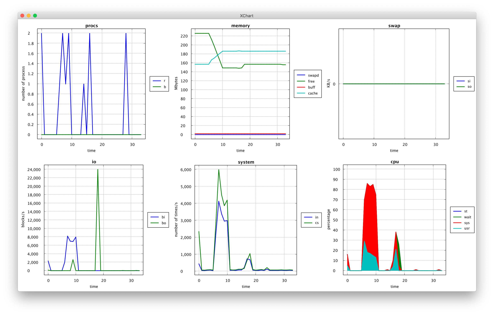

# StatChart

WIP

- build

```
$ gradlew shadowJar
```

- correct data

```
$ vmstat >> vmstat.txt
```

```vmstat.txt
procs -----------memory---------- ---swap-- -----io---- -system-- ------cpu-----
 r  b   swpd   free   buff  cache   si   so    bi    bo   in   cs us sy id wa st
 1  0      0 144832   2076 206968    0    0    17     7  138  903  4  4 92  0  0
 0  0      0 144832   2076 206972    0    0     0     0   21   33  0  0 100  0  0
 0  0      0 144832   2076 206972    0    0     0     0   24   31  0  0 100  0  0
 0  0      0 144832   2076 206972    0    0     0     0   19   30  0  0 100  0  0
 0  0      0 144832   2076 206972    0    0     0     0   18   26  0  0 100  0  0
 0  0      0 144832   2076 206972    0    0     0     0   29   41  0  0 100  0  0
 0  0      0 144832   2076 206972    0    0     0     0   22   33  0  0 100  0  0
 0  0      0 144832   2076 206972    0    0     0     0   18   27  0  0 100  0  0
 0  0      0 144832   2076 206972    0    0     0     0   25   38  0  1 99  0  0
```
- execute

```
$ java -jar build/libs/StatChart-0.1-all.jar /path/to/vmstat.txt 
```



